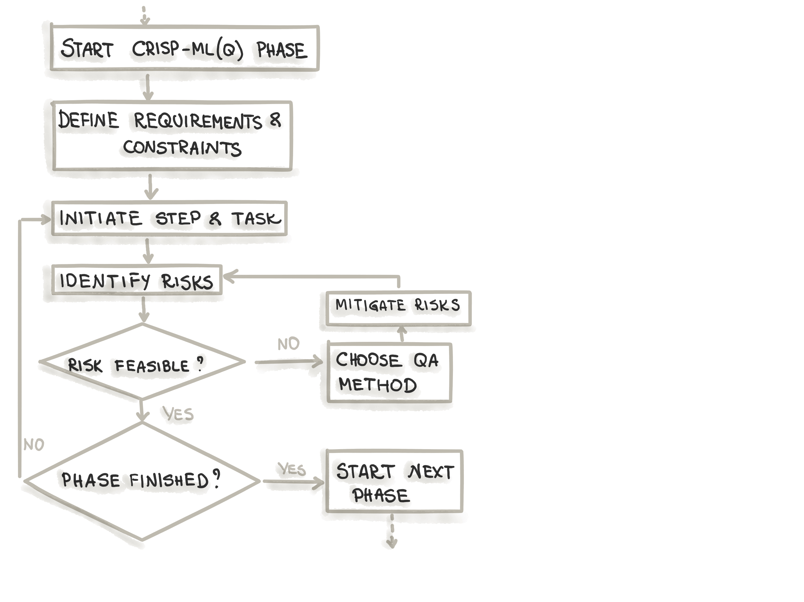
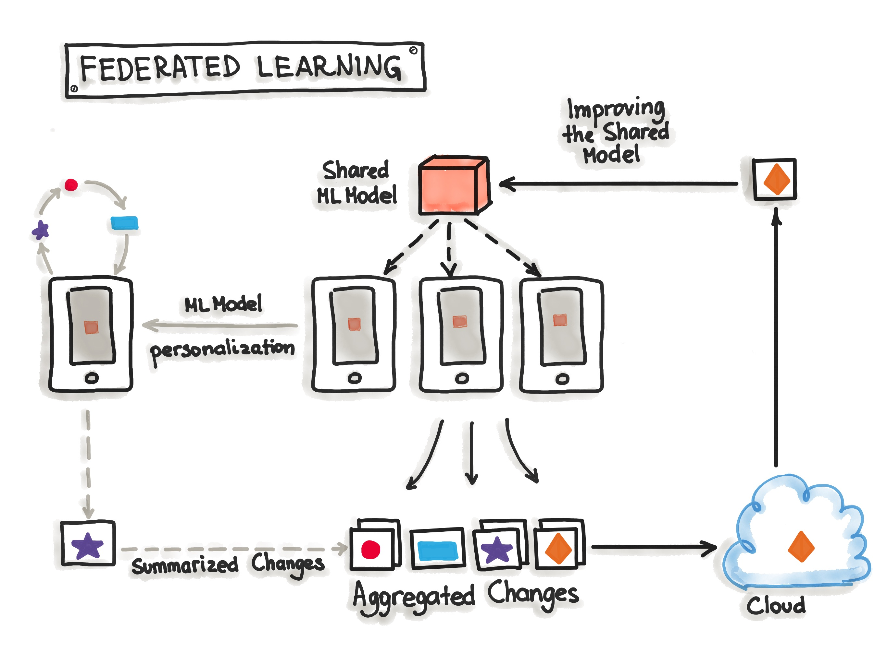
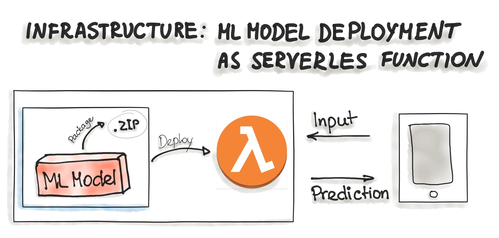

# Model Deployment

We will visit different steps involved in MLOps pipeline.

> Machine Learning Model Operationalization Management - MLOps, as a DevOps extension, establishes effective practices and processes around designing, building, and deploying ML models into production.

In paper titled [Towards CRISP-ML(Q): A Machine Learning Process Model with Quality Assurance Methodology](https://arxiv.org/pdf/2003.05155.pdf), the authors introduce a methodology or a process model for development of ML applications called **CRoss-Industry Standard Process model for the development of Machine Learning applications with Quality assurance methodology (CRISP-ML(Q))**. CRISP-ML(Q) offers ML community a standard process to streamline ML and data science projects making results reproducible. It is designed for development of ML applications where ML model is deployed and maintained as part of product or service.

 
<a href="https://ml-ops.org/content/crisp-ml">Source</a>

CRISP-ML(Q) process model consits of 6 phases:

1. Business & Data Understanding
2. Data Preparation
3. Modelling
4. Evaluation
5. Deployment
6. Monitoring and Maintenance

For each phase, the flow chart below explains quality assurance approach in CRISP-ML(Q). In the first step, clear objective for the current phase are defined, followed by taking steps to initiate the task, followed by identifying the risks that might negatively impact the efficiency and success of the ML application (e.g., bias, overfitting, lack of reproducibility, etc.), quality assurance methods to mitigate risks when these risks need to be diminished (e.g., cross-validation, documenting process and results, etc.).

 
<a href="https://ml-ops.org/content/crisp-ml">Source</a>

## Model Deployment

The ML model deployment includes following tasks :

* Define inference hardware and optimize ML model for target hardware
* Evaluate model under production condition
* Assure user acceptance and usability
* Minimize the risks of unforseen errors
* Deployment strategy

> A wise person on the Internet once said: deploying is easy if you ignore all the hard parts. If you want to deploy a model for your friends to play with, all you have to do is to create an endpoint to your prediction function, push your model to AWS, create an app with Streamlit or Dash. The hard parts include making your model available to millions of users with a latency of milliseconds and 99% uptime, setting up the infrastructure so that the right person can be immediately notified when something went wrong, figuring out what went wrong, and seamlessly deploying the updates to fix what’s wrong. [Source](https://docs.google.com/document/d/1hNuW6bqWYZjlwpit_8W1cu7kllb-jTfy3Liof1GJWug/edit) by Chip Huyen

## Model Serving and Deployment Patterns

Source: <https://ml-ops.org/content/three-levels-of-ml-software>

Model serving is a way to integrate the ML model in a software system. There are two aspects for deploying ML system in a production environment. First deploying pipeline for automated retraining and second providing endpoint to ingest input data and provide predictions using ML model.

There are 5 popular model serving patterns to put ML model into production

1. Model-as-Service

 
<a href="https://ml-ops.org/content/three-levels-of-ml-software">Source</a>

2. Model-as-Dependency

 
<a href="https://ml-ops.org/content/three-levels-of-ml-software">Source</a>

3. Precompute

 
<a href="https://ml-ops.org/content/three-levels-of-ml-software">Source</a>

4. Model-on-Demand

 
<a href="https://ml-ops.org/content/three-levels-of-ml-software">Source</a>

5. Hybrid-Serving

 
<a href="https://ml-ops.org/content/three-levels-of-ml-software">Source</a>

There are 2 popular deployment strategies

1. Deploying ML models as Docker Containers

 
<a href="https://ml-ops.org/content/three-levels-of-ml-software">Source</a>

2. Deploying ML Models as Serverless Functions

 
<a href="https://ml-ops.org/content/three-levels-of-ml-software">Source</a>

## Recommended Readings

* [CRISP-ML(Q) introduction blog my ml-ops.org](<https://ml-ops.org/content/crisp-ml>)
* [Chapter 7: Model Deployment by Chip Huyen](https://docs.google.com/document/d/1hNuW6bqWYZjlwpit_8W1cu7kllb-jTfy3Liof1GJWug/edit?usp=sharing)
* [Three Levels of ML Software](https://ml-ops.org/content/three-levels-of-ml-software)
* [Bringing ML to Production (Slides)](https://appliedmldays.org/rails/active_storage/blobs/eyJfcmFpbHMiOnsibWVzc2FnZSI6IkJBaHBBaWNEIiwiZXhwIjpudWxsLCJwdXIiOiJibG9iX2lkIn19--3727d34ba09369801287aa2fc4ee35307e11eb92/01%20-%2013h30%20-%2014h05%20-%20Mikio%20Braun.pdf?disposition=preview)
* [Serving](https://huyenchip.com/machine-learning-systems-design/design-a-machine-learning-system.html#serving-091rIYw) and [Case Studies](https://huyenchip.com/machine-learning-systems-design/case-studies.html)

## Model Serving

In this project, our focus will be on different approaches we can serve ML model. [MLOps.toys](https://mlops.toys/) provides a comprehensive survey of different frameworks that exists for [Model Serving](https://mlops.toys/model-serving). The focus of this project would be to explore all 10+ frameworks and many more along with cloud services for serving and testing the endpoint of deployed ML model.

We will start with simple exercise of how to make use of Github Actions for CI/CD. As we go down, we will integrate various technologies such as Github Actions, Docker, PyTest, Linting while testing different ML model serving frameworks visiting best practices.

1. [Makefile](exercises/1-makefile) : In this exercise, we will automate the task of installing packages, linting, formatting and testing using Makefile.

   **Technologies : Pytest, Make**

2. [Github Actions Makefile](https://github.com/dudeperf3ct/2-github-actions-makefile): In this exercise, we will automate the task of installing packages, linting, formatting and testing using github actions.

   **Technologies: Pytest, Make, Github Actions**

3. [Github Actions Docker](https://github.com/dudeperf3ct/3-github-actions-docker):  In the exercise, we will implement the following:

      * Containerize a GitHub project by integrating a Dockerfile and automatically registering new containers to a Container Registry.

      * Create a simple load test for your application using a load test framework such as locust or loader io and automatically run this test when you push changes to a staging branch

   **Technologies: Docker, Github Actions, Locust**

4. [FastAPI Azure](https://github.com/dudeperf3ct/4-ml-fastapi-azure-serverless): In this exercise, we will build a fastapi ML application and deploy it with continuous delivery on Azure using Azure App Services and Azure DevOps Pipelines.

   **Technologies: Docker, FastAPI, Continuous Delivery using Azure App Services, Azure DevOps Pipelines**

5. [FastAPI GCP](https://github.com/dudeperf3ct/5-ml-fastapi-gcp-serverless): In this exercise, we will build a fastapi ML application and deploy it with continuous delivery on GCP using Cloud Run and Cloud Build.

   **Technologies: Docker, FastAPI, Continuous Delivery using GCP Cloud Run and Cloud Build**

6. [FastAPI AWS](https://github.com/dudeperf3ct/6-ml-fastapi-aws-serverless): In this exercise, we will build a fastapi ML application and deploy it with continuous delivery on AWS using AWS using Elastic Beanstalk and Code Pipeline.

   **Technologies: Docker, FastAPI, sklearn, Continuous Delivery using Elastic Beanstalk and Code Pipeline**

7. AWS Terraform Deploy: To be implemented

8. [FastAPI GKE](https://github.com/dudeperf3ct/8-fastapi-tests-gcp-gke): In this project, we will deploy a sentiment analyser model using fastapi on GCP using GKE.

      * Containerizing different components of projects

      * Writing tests and testing individual modules using `pytest`

      * Using [trunk](https://docs.trunk.io/) for automatic code checking, formatting and liniting

      * Deploying application on GKE

   **Technologies: Docker, FastAPI, HuggingFace Transformer model, Pytest, Trunk, GKE**

9. [FastAPI Kubernetes Monitoring](https://github.com/dudeperf3ct/9-fastapi-kubernetes-monitoring): In this exercise, we will introduce Kubernetes. Using Kubernetes deploy fastapi application and monitor this application using `Prometheus` and `Grafana`, following best practices of writing tests and trigger a CI workflow using github actions.

   **Technologies: Docker, Docker-compose, Pytest, FastAPI, HuggingFace Transformer model, Continuous Integration using Github Actions, Kubernetes, Prometheus, Grafana**

10. [BentoML Deploy](https://github.com/dudeperf3ct/10-bentoml-deploy): In this exercise, we will use BentoML library to deploy the sentiment classification model from Hugging Face :hugs: on following services.

      * [AWS Lambda Deployment](https://github.com/dudeperf3ct/10-bentoml-deploy/blob/main/aws%20lambda/Readme.md)

      * [Azure Functions Deployment](https://github.com/dudeperf3ct/10-bentoml-deploy/blob/main/azure%20functions/Readme.md)

      * [Kubernetes Cluster Deployment](https://github.com/dudeperf3ct/10-bentoml-deploy/blob/main/kubernetes/Readme.md)

      **Technologies: Docker, Pytest, FastAPI, HuggingFace Transformer model, AWS Lambda, Azure Functions, Kubernetes, BentoML**

11. [Cortex Deploy](https://github.com/dudeperf3ct/11-cortex-deploy): In this exercise, transformers sentiment classifier fastapi application is deployed using Cortex two different APIs.

      * [Realtime API](https://github.com/dudeperf3ct/11-cortex-deploy/blob/main/realtime/Readme.md)

      * [Async API](https://github.com/dudeperf3ct/11-cortex-deploy/blob/main/async/Readme.md)

      **Technologies: Docker, Cortex, FastAPI, HuggingFace Transformer model, Continuous Integration using Github Actions, Trunk.io linter**

12. [Serverless Deploy](https://github.com/dudeperf3ct/12-serverless-deploy): In this exercise, hugging face transformers sentiment classifier FastAPI application is deployed using Serverless Framework.

      * [Serverless Framework](https://github.com/dudeperf3ct/12-serverless-deploy#serverless-framework)

      **Technologies: Docker, Serverless Framework, FastAPI, HuggingFace Transformer model, Continuous Integration using Github Actions, Trunk.io linter**

13. [Bodywork Train and Deploy](https://github.com/dudeperf3ct/13-bodywork-train-deploy.git): This exercise contains a Bodywork project that demonstrates how to run a ML pipeline on Kubernetes, with Bodywork. The example ML pipeline has two stages:

       * Run a batch job to train a model.

       * Deploy the trained model as service with a REST API.

      **Technologies: Bodywork, Sklearn, Flask, Kubernetes, Cronjob**

14. [KServe Deploy](https://github.com/dudeperf3ct/14-kserve-deploy): In this exercise, we will deploy the sentiment analysis huggingface transformer model. Since MLServer does not provide out-of-the-box support for PyTorch or Transformer models, we will write a custom inference runtime to deploy this model and test the endpoints.

      **Technologies: Docker, KServe, HuggingFace Transformer model, Pytest, Kubernetes, Istio, Knative, Kind, TorchServe**

      [TorchServe](https://github.com/dudeperf3ct/torchserve-huggingface-transformers): Deploying hugging face transformer model using torchserve.

15. [MLServer Deploy](https://github.com/dudeperf3ct/15-mlserver-deploy): In this exercise, we will deploy the sentiment analysis huggingface transformer model. Since MLServer does not provide out-of-the-box support for PyTorch or Transformer models, we will write a custom inference runtime to deploy this model and test the endpoints.

      **Technologies: Docker, MLServer, HuggingFace Transformer model**

16. [Ray Serve Deploy](https://github.com/dudeperf3ct/16-rayserve-deploy):  In this exercise, we will deploy the sentiment analysis huggingface transformer model using Ray Serve so it can be scaled up and queried over HTTP using two approaches.

      * Ray Serve default approach

      * Ray Serve with FastAPI

      **Technologies: Docker, Ray Serve, FastAPI, HuggingFace Transformer model**

17. [Seldon core Deploy](https://github.com/dudeperf3ct/17-seldon-core-deploy):  In this exercise, we will deploy a simple sklearn iris model using Seldon Core. We will deploy using two approaches and test the endpoints .

      * Seldon core default approach

      * V2 Inference protocol

      **Technologies: Docker, Seldon Core, Sklearn model, Kubernetes, Istio, Helm, Kind**

18. Nvidia Triton Deploy: Coming Soon
